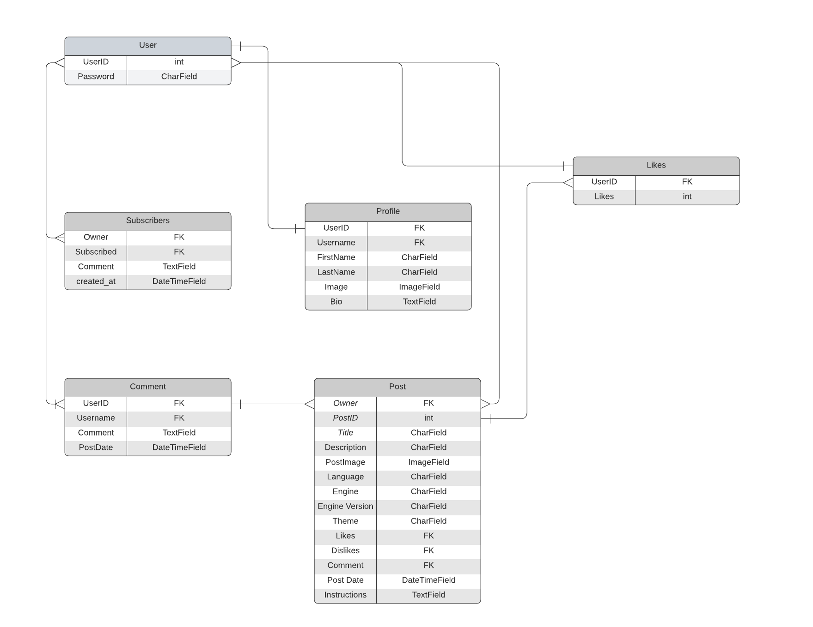

# Gameversity API

## [React repository](https://github.com/PatSvedberg/gameversity-react)
## [Deployed API](https://gameversity-api.herokuapp.com/)
## [Deployed React](https://gameversity.herokuapp.com/)
<br />

# Project Goal
The primary goal of this project is to create a website where game developers can upload their own game development tutorials in text form. There are a lot of video tutorials for game development, but sometimes a smaller tutorial with text and pictures can be easier. This website aims to become a comprehensive hub for game development knowledge, enabling developers from all around the world to share their wisdom and learn from each other. Whether you're an experienced developer with a lot of knowledge to share or a newbie looking for guidance, this site is for you.

# Future Features
* Initially, I had an idea to add a feature to the tutorial creation form. Instead of having an "instructions" section, I wanted to include a section called "steps" at the bottom of the page. In this section, users could provide information using a text field and upload images for each step. They would be able to add as many steps as they wanted. I managed to implement this feature in the backend, but I encountered difficulties while working on it in React. I asked my mentor and reached out to tutor support twice, but unfortunately, I couldn't find a solution. I believe the problem was that each step needed its own model with a connection to the tutorial. However, since the tutorial wasn't technically created until the user clicked the submit button, I struggled to find a way around it. Since I had already spent a lot of time on it, I decided to opt for a simpler solution for now. However, I have kept the step model for future implementation.

# Planning
In the beginning of the project, I focused on planning. I started by creating user stories for the frontend application. These stories were based on the project's goals and helped me understand what users would want from the app.

The user stories served as a guide to create wireframes, which showed how the app would work and how users would use it. They gave me a clear picture of how people would interact with the app and the steps they would take to get things done.

Once I had the user stories and wireframes ready, I figured out the essential features needed to make a Minimum Viable Product (MVP). I broke down each user story into smaller tasks and connected them to the necessary parts of the app's backend (API endpoints) that would support the required features.

This process of creating user stories, making wireframes, and connecting them to the backend ensured that my development path was clear and focused. It helped me create a seamless and user-friendly app by aligning the frontend experience with the backend functionality.
# Data models
I planned the data model schema concurrently with the API endpoints by utilizing an entity relationship diagram.
The custom models implemented for the project include:
## Tutorial
## Subscribers
## Profiles
## Likes

## ERD



# API Endpoints
## Endpoints and testing

| URL | Result |
| :---:   | :---: |
| / | Works as expected |
| /tutorials/ | Works as expected |
| /tutorials/<`id`> | Works as expected |
| /profiles/ | Works as expected  |
| /profiles/<`id`> | Works as expected |
| /likes/ | Works as expected |
| /likes/<`id`> | Works as expected |
| /subscribers/ | Works as expected |
| /subscribers/<`id`>  | Works as expected |

# Technologies Used
## Languages and Frameworks Used
* [Python](https://www.python.org/) - The main programming language.
* [Django](https://pypi.org/project/Django/3.2.14/) - Python Web framework used to develop the project.
* [djangorestframework](https://pypi.org/project/djangorestframework/3.14.0/) - Toolkit for building web API's with Django.

## Python Modules Used
* Built-in Packages/Modules
    * [pathlib](https://docs.python.org/3/library/pathlib.html) - Used to work with filepaths.
    * [os](https://docs.python.org/3/library/os.html) - This module provides a portable way of using operating system dependent functionality.

## Packages Used
* External Python Packages
    * [Cloudinary](https://pypi.org/project/cloudinary/1.30.0/) - Cloudinary integration.
    * [django-cloudinary-storage](https://pypi.org/project/django-cloudinary-storage/0.3.0/) - Cloudinary integration.
    * [dj-database-url](https://pypi.org/project/dj-database-url/0.5.0/) - Allows the use of 'DATABASE_URL' environmental variable in the Django project settings file to connect to a PostgreSQL database.
    * [django-allauth](https://pypi.org/project/django-allauth/0.51.0/) - Set of Django applications used for account registration, management and authentication.
    * [dj-rest-auth](https://pypi.org/project/dj-rest-auth/2.2.5/) - API endpoints for handling authentication in Django Rest Framework.
    * [django-filter](https://pypi.org/project/django-filter/22.1/) - Application that allows dynamic QuerySet filtering from URL parameters.
    * [djangorestframework-simplejwt](https://pypi.org/project/djangorestframework-simplejwt/5.2.1/) - JSON Web Token authentication backend for the Django REST Framework.
    * [django-cors-headers](https://pypi.org/project/django-cors-headers/3.13.0/) - Django App that adds CORS headers to responses. 
    * [gunicorn](https://pypi.org/project/gunicorn/20.1.0/) - Python WSGI HTTP Server.
    * [Pillow](https://pypi.org/project/Pillow/9.2.0/) - Fork of PIL, the Python Imaging Library which provides image processing capabilities.
    * [psycopg2](https://pypi.org/project/psycopg2/2.9.3/) - Python PostgreSQL database adapter.

## Programs and Tools Used
* [Lucidchart](https://www.lucidchart.com/) - Create Database Schema/ERD
* [Gitpod](https://gitpod.io/workspaces) Gitpod was used to edit code
* [GitHub](https://github.com/) Version control

# Testing
# Deployment

## Github Repository
* Create repository from the Code institute **[ci-full-template](https://github.com/Code-Institute-Org/ci-full-template)**
* Give it a name
* Open it up with Github from the green **Gitpod** button
    * If there is no button. Download the **Gitpod** extension for your browser.

## Django
* Install **Django** by entering **`pip3 install 'django<4'`** in the terminal 
* Create a project by entering **`django-admin startproject <projectname> .`** in the terminal

## Create Django app
* In the terminal enter **`python manage.py startapp <appname>`**
* And add the app to the installed app inside **settings.py**

## Cloudinary
* Go to **[Cloudinary](https://cloudinary.com/)**
* Fill out the form and sign up for free
* Go to the dashboard and 
* To be able to connect to Cloudinary enter **`pip install django-cloudinary-storage`** in the terminal
* Add **Cloudinary** to Installed apps in **settings.py**
* Install **Pillow** by entering **`pip install Pillow`** in the terminal
* Create **env.py** file and add **`import os`** and **`os.environ ['CLOUDINARY_URL'] = '<URL from Cloudinary Dashboard>'`**
* Inside **settings.py**, under **`from pathlib import Path`** add the following code to set up Cloudinary storage:
```
import os

if os.path.exists('env.py'):
    import env

CLOUDINARY_STORAGE = {
    'CLOUDINARY_URL': os.environ.get('CLOUDINARY_URL')
}
MEDIA_URL = '/media/'
DEFAULT_FILE_STORAGE = 'cloudinary_storage.storage.MediaCloudinaryStorage'
```
## Heroku
* Login to **[Heroku](https://dashboard.heroku.com/apps)** and go to the **Dashboard**
* Click **New**
* Click **Create new app**
* Give your app a name and select the region closest to you. When you’re done, click **Create app** to confirm
    * *Heroku app names must be unique. If yours isn't, Heroku will give you a warning*
* Open the **Settings** tab
* Add a Config Var **DATABASE_URL**, and for the value, copy in your database URL from ElephantSQL
    * *View the next section to find the ElephantSQL deployment*
* Install **gunicorn**. Enter in the terminal:
```
 pip3 install gunicorn django-cors-headers
```
* Update your **requirements.txt**
```
 pip freeze --local > requirements.txt
```
* Create a **Procfile**, inside the file add:
```
 release: python manage.py makemigrations && python manage.py migrate
 web: gunicorn <projectname>.wsgi
```
* In your **settings.py** file, update the value of the **ALLOWED_HOSTS** variable to include your Heroku app’s URL
    * *Make use not to use **https://** in the URL. To me that caused a problem with Heroku.*
```
ALLOWED_HOSTS = ['localhost', '<your_app_name>.herokuapp.com']
```
* Add corsheaders to INSTALLED_APPS
```
INSTALLED_APPS = [
    ...
    'corsheaders',
    ...
 ]
```

* Add **corsheaders** middleware to the **TOP** of the **MIDDLEWARE**

``` 
SITE_ID = 1
MIDDLEWARE = [
     'corsheaders.middleware.CorsMiddleware',
     ...
 ]
 ```

* **Under the MIDDLEWARE** list, set the **ALLOWED_ORIGINS** for the network requests made to the server with the following code:

``` 
 if 'CLIENT_ORIGIN' in os.environ:
     CORS_ALLOWED_ORIGINS = [
         os.environ.get('CLIENT_ORIGIN')
     ]
 else:
     CORS_ALLOWED_ORIGIN_REGEXES = [
         r"^https://.*\.gitpod\.io$",
     ]
 ```
 * Enable sending cookies in cross-origin requests so that users can get authentication functionality
 ```
 else:
     CORS_ALLOWED_ORIGIN_REGEXES = [
         r"^https://.*\.gitpod\.io$",
     ]

 CORS_ALLOW_CREDENTIALS = True
 ```
* To be able to have the front end app and the API deployed to different platforms, set the **JWT_AUTH_SAMESITE** attribute to **'None'**. Without this the cookies would be blocked
```
JWT_AUTH_COOKIE = 'my-app-auth'
JWT_AUTH_REFRESH_COOKE = 'my-refresh-token'
JWT_AUTH_SAMESITE = 'None'
```
* Remove the value for SECRET_KEY and replace with the following code to use an environment variable instead
```
SECRET_KEY = os.getenv('SECRET_KEY')
```
* Set the DEBUG value to be **True only if the DEV environment variable exists**. This will mean it is True in development, and False in production
```
DEBUG = 'DEV' in os.environ
```
* Comment **DEV** back in **env.py**
```
import os

 os.environ['CLOUDINARY_URL'] = "cloudinary://..."
 os.environ['SECRET_KEY'] = "Z7o..."
 os.environ['DEV'] = '1'
 os.environ['DATABASE_URL'] = "postgres://..."
```
Ensure the project **requirements.txt** file is up to date. In the **IDE terminal** of your project enter the following:
```
pip freeze --local > requirements.txt
```
* **Add, commit and push** your code to **GitHub**

## Elephant SQL
* Login to **[ElephantSQL](https://www.elephantsql.com/)**
* Click **Create New Instance**
* Set up your plan:
    * Give you plan a name
    * Select the **Tiny Turtle** plan **(Free)**
    * **Tags** can be left blank
* Click **Select Region**
* Select a data center near you
* Click **Review**
* Check your details and then click **Create Instance**
* Install **dj_database_url** and **psycopg2**, both of these are needed to connect to your external database
* In the terminal, enter:
```
 pip3 install dj_database_url==0.5.0 psycopg2
```
* In your **settings.py** file, import **dj_database_url** underneath the import for os
```
 import os
 import dj_database_url
```
* Update the DATABASES section to the following:
```
if 'DEV' in os.environ:
     DATABASES = {
         'default': {
             'ENGINE': 'django.db.backends.sqlite3',
             'NAME': BASE_DIR / 'db.sqlite3',
         }
     }
 else:
     DATABASES = {
         'default': dj_database_url.parse(os.environ.get("DATABASE_URL"))
     }
```
* Return to the ElephantSQL dashboard and click on the **database instance name** for your project
* In the URL section, click the copy icon to **copy the database URL**
* In your **env.py** file, add a new environment variable with the key set to **DATABASE_URL**, and the value to your **ElephantSQL database URL**
```
 os.environ['DATABASE_URL'] = "<your PostgreSQL URL here>"
```
* Migrate your database models to your new database
```
  python3 manage.py migrate
```
* Create a superuser for your new database
```
 python3 manage.py createsuperuser
```
* Follow the steps to create your superuser username and password
* Confirm that the data in your database on ElephantSQL has been created
* On the **ElephantSQL** page for your database, in the left side navigation, select **BROWSER**
* Click the **Table queries** button, select **auth_user**
* When you click **Execute**, you should see your newly created superuser details displayed. This confirms your tables have been created and you can add data to your database